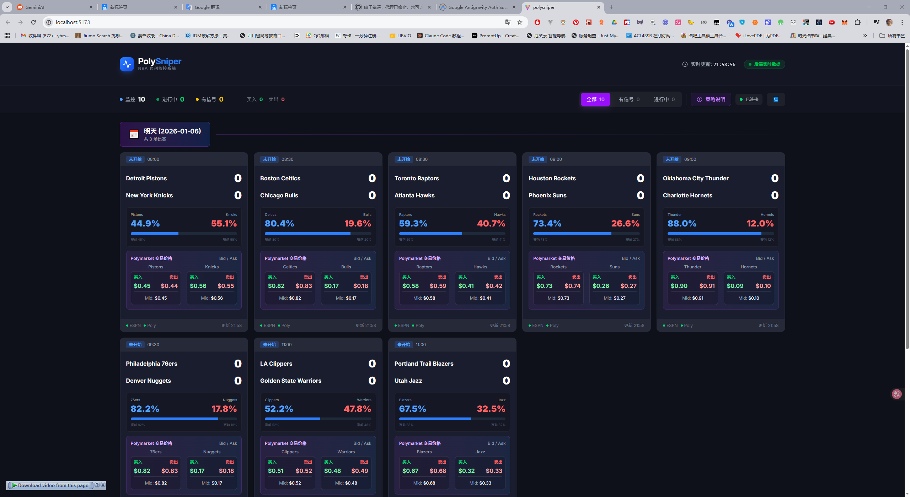

# 🎯 PolySniper

**NBA Sports Arbitrage Monitoring Platform** - Real-time monitoring of ESPN odds and Polymarket prediction markets to automatically discover arbitrage opportunities

[](https://www.typescriptlang.org/)
[](https://reactjs.org/)
[](https://nodejs.org/)

> 🌏 **[中文文档](./README.zh-CN.md)** | **English**

> 📖 **Detailed Documentation**: [API Documentation](./server/API.md)

## 📸 Interface Preview



## 📁 Project Structure

```
polysniper/
├── client/          # Frontend app (React + Vite + TailwindCSS)
├── server/          # Backend service (Node.js + Express + WebSocket)
├── package.json     # Root configuration
└── README.md        # Project documentation
```

## 🚀 Quick Start

### Install Dependencies

```bash
# Install all dependencies (root + frontend + backend)
npm run install:all
```

### Development Mode

```bash
# Start both frontend and backend dev servers
npm run dev

# Or start separately
npm run dev:server  # Backend: http://localhost:3000
npm run dev:client  # Frontend: http://localhost:5173
```

### Production Build

```bash
# Build frontend and backend
npm run build

# Start production server
npm start
```

## 🔧 Tech Stack

### Frontend
- **Framework**: React 19 + TypeScript
- **Build Tool**: Vite 7
- **Styling**: TailwindCSS 4
- **Charts**: Recharts
- **Icons**: Lucide React
- **WebSocket**: Socket.IO Client

### Backend
- **Runtime**: Node.js + TypeScript
- **Framework**: Express
- **WebSocket**: Socket.IO
- **Cache**: Redis (optional)
- **Logging**: Winston
- **Data Sources**: 
  - ESPN API (game schedules, live scores, win probabilities, injury reports)
  - Polymarket API (market price data)

## 📡 API Endpoints

### REST API
- `GET /health` - Health check
- `GET /api/matches` - Get all matches
- `GET /api/matches/:id` - Get single match
- `GET /api/signals` - Get arbitrage signals
- `GET /api/stats` - Get statistics

### WebSocket
- **Connection**: `ws://localhost:3000`
- **Events**:
  - `subscribe` - Subscribe to match updates
  - `unsubscribe` - Unsubscribe from matches
  - `matchesUpdate` - Receive match updates
  - `signalAlert` - Receive arbitrage signals

📖 Detailed API Documentation: [server/API.md](./server/API.md)

## ✨ Core Features

- ⚡ **Millisecond Real-time Updates** - WebSocket push, price latency < 1s
- 🔄 **Multi-source Data Integration** - ESPN odds + Polymarket prediction markets
- 💰 **Automatic Arbitrage Detection** - EV+ model, triggers at >10% profit margin
- 🤖 **Paper Trading** - Q1-Q3 value reversion strategy with hybrid exit mechanism
- 💸 **Real Price Simulation** - Use Ask for buying, Bid for selling, includes slippage
- 🎯 **Smart Exit Strategy** - Take profit (25%) + logic invalidation + hard stop loss (50%)
- 📊 **Data Visualization** - ESPN-style win probability curves with interactive hover
- 🎯 **Intelligent Matching** - Three-layer funnel for precise team and market matching
- ⏰ **Time Control** - Only trade Q1-Q3, avoid Q4 gambling logic

## 📊 Data Update Strategy

### Real-time Data (No Cache)
- ✅ **Scores, Time, ESPN Win Prob, Polymarket Prices**
- ESPN: Request every **3 seconds** (throttled)
- Polymarket: **WebSocket real-time push** (passive receive)
- Frontend: Push every **500ms**

### Static Data (24-hour Long Cache)
- ✅ **Today's Match List, Token IDs, Market IDs, Team Mappings**
- This data doesn't change during games
- Reduces API requests, improves performance

### Price System
| Price Type | Usage | Source |
|---------|------|------|
| **Ask (Sell Price)** | Pay when buying | `asks[0].price` |
| **Bid (Buy Price)** | Receive when selling | `bids[0].price` |
| **Mid (Mid Price)** | Display, valuation | `(Bid + Ask) / 2` |

## 🔐 Environment Configuration

### Backend (.env)

```bash
# Service Configuration
PORT=3000
NODE_ENV=development

# Polymarket WebSocket (⚠️ Requires proxy in China!)
POLYMARKET_WS_ENABLED=true
POLYMARKET_WS_URL=wss://ws-subscriptions-clob.polymarket.com/ws/market
POLYMARKET_WS_PROXY=http://127.0.0.1:7890

# CORS
CORS_ORIGIN=*

# Redis (optional)
REDIS_ENABLED=false

# Log level (debug to see heartbeat details)
LOG_LEVEL=info
```

> ⚠️ **Important**: 
> - Polymarket WebSocket requires HTTP proxy access (for networks in China)
> - Heartbeat mechanism uses WebSocket protocol-level Ping/Pong (15s interval)

## 📝 Development Guide

### Frontend Development
```bash
cd client
npm run dev      # Start dev server
npm run build    # Production build
npm run lint     # Code linting
```

### Backend Development
```bash
cd server
npm run dev      # Start dev server
npm run build    # TypeScript compilation
npm run test     # Run tests
```

## 📦 Deployment

### Using PM2 (Recommended)
```bash
cd server
npm run start:pm2
```

### Docker (To Be Implemented)
```bash
docker-compose up -d
```

## ⚠️ Important Notes

1. **Proxy Required** 🌐
   - Polymarket API requires proxy access
   - Configure `POLYMARKET_WS_PROXY` environment variable

2. **WebSocket Subscription Limits** 📡
   - Maximum 10 tokens per subscription
   - 100ms interval between batches
   - Avoid `INVALID OPERATION` errors

3. **Special Team Name Handling** 🏀
   - Thunder team name contains "under"
   - Requires special logic to avoid false exclusion

4. **Data Latency** ⏱️
   - Polymarket WebSocket: < 1s
   - ESPN polling: 2-30s (dynamically adjusted)

## 💼 Paper Trading System

### 🎯 Core Features

- **Auto-run** - Automatically initialized after project starts, no manual configuration needed
- **Persistent Storage** - Uses SQLite database, data saved permanently
- **Real Simulation** - Buy at Ask, sell at Bid, includes slippage
- **Smart Strategy** - Q1-Q3 value reversion with hybrid exit mechanism

### 💾 Database Usage

#### Database File Location
```
server/data/polysniper.db
```

#### Common Commands

```bash
cd server

# View database status (account balance, positions, orders)
npm run init-db

# View latest 20 market snapshots
npm run view-snapshots

# Reset database (clear all data, start fresh)
npm run reset-db
```

### 📊 Auto-recorded Content

#### 1. Paper Trading Account
- Initial balance: $1000
- Current balance
- Total trades, win rate
- Total P&L, P&L percentage

#### 2. Trade Orders
- Buy/sell records
- Entry/exit prices
- P&L statistics
- **Battle Context**: scores, quarter, time, ESPN probabilities

#### 3. Market Snapshots (every 3 seconds)
- **Only saves LIVE and FINAL status** (pre-game data not saved)
- Scores, probabilities, prices
- Arbitrage signals

### 🔄 Data Persistence Flow

```
Start project → Auto-connect to database
Game starts → Begin saving snapshots
Find signal → Auto-place order and record
Game ongoing → Update position P&L
Game ends → Auto-close and record
Close project → Data remains in database
Restart project → Auto-load previous data
```

### 💡 Important Notes

1. **Data Never Lost** - SQLite database persistently saves all data
2. **Auto-initialize** - First run automatically creates $1000 initial account
3. **Pre-game Not Recorded** - Only saves LIVE/FINAL status snapshots to avoid invalid data
4. **Privacy Protected** - `.db` file added to `.gitignore`

### 📈 View Trading Data

**Real-time View (Frontend)**:
- Visit `http://localhost:5173`
- Check "Paper Trading" panel

**Historical View (Command Line)**:
```bash
cd server
npm run view-snapshots  # View market snapshots
npm run init-db         # View account status
```

### 🤖 Trading Strategy

```typescript
// Runs automatically, no configuration needed
Initial Capital: $1000 USDC
Position Management: 10% capital per trade
Trading Logic: 
  - Find signal → Auto buy (Ask price)
  - Real-time P&L → Market valuation (Mid price)
  - Game ends → Auto close (Bid price)

Exit Strategy:
  - Take Profit: Profit ≥ 25%
  - Logic Invalidation: ESPN prob reversal ≥ 20%
  - Hard Stop Loss: Loss ≥ 50%
```

**Example Logs:**
```
✅ [Paper Trading] Buy LA Clippers x11.63 @$0.8600 (Ask price, cost: $10.00)
   Order ID: ORD000001, Confidence: 95.0%, Balance: $990.00
   Battle: Score 85-82, Q2 3:45, ESPN prob 72%

🔒 [Paper Trading] Close LA Clippers @$0.9500
   P&L: +$10.47 (+121.88%), Balance: $1010.47
   Exit Reason: Take Profit
```


## 📚 Documentation Index

### Core Documentation
- 📖 **[README](./README.md)** - Project overview (English)
- 📖 **[中文文档](./README.zh-CN.md)** - Project overview (Chinese)

### API Documentation
- 📡 **[API Documentation](./server/API.md)** - REST API & WebSocket (English)
- 📡 **[API 接口文档](./server/API.zh-CN.md)** - REST API & WebSocket (Chinese)

## 🤝 Contributing

Issues and Pull Requests are welcome!

## 📄 License

ISC License

## 📞 Contact

yhrsc30@gmail.com
